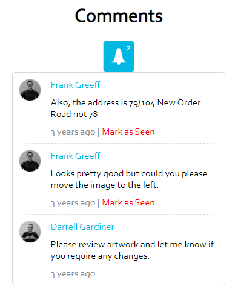

# Realhub React Test

Deployed site: http://realhub-react.s3-website-ap-southeast-2.amazonaws.com/

## Requirements

- Component is built using React.js
- Component uses ES6 syntax and features
- Component is built as a Functional Component
- Uses React Hooks
- Comments are ordered in reverse chronological order (newest comments first).
- Ability to mark comments as "seen" / acknowledged
- If there are unseen comments the button is blue
- Once all comments are marked as "seen" / acknowledged the button returns to its default state
- Deployed online

## Bonus

- A unseen comment count bubble/icon
- Simple and elegant animation

## Screenshot

